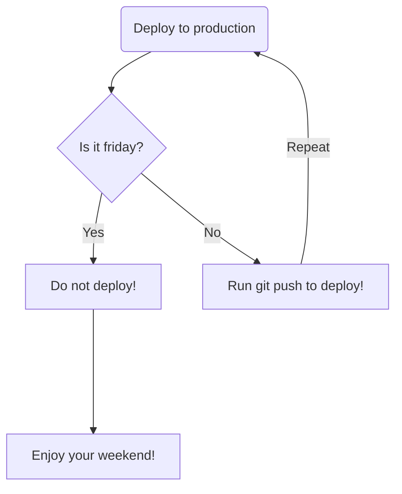

# class-utils

From the creators of class-utils-old. We bring you. class-utils. A new "highly available" serverless postgres vercel integrated application for school purposes.

Deployed on vercel [here](https://klasseverktoy.vercel.app/)

